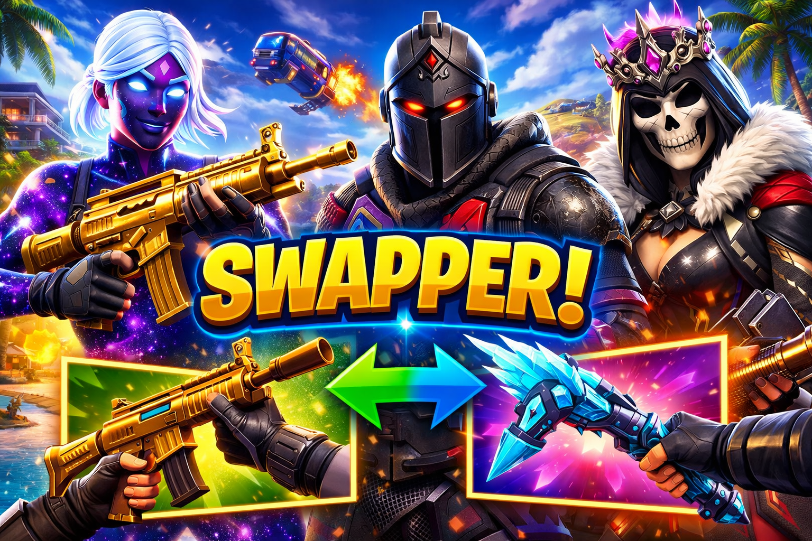
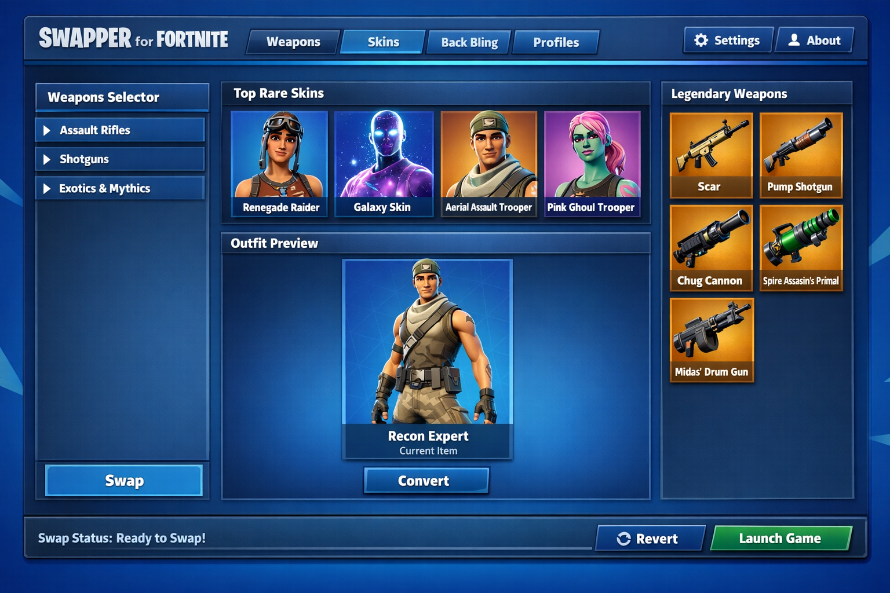
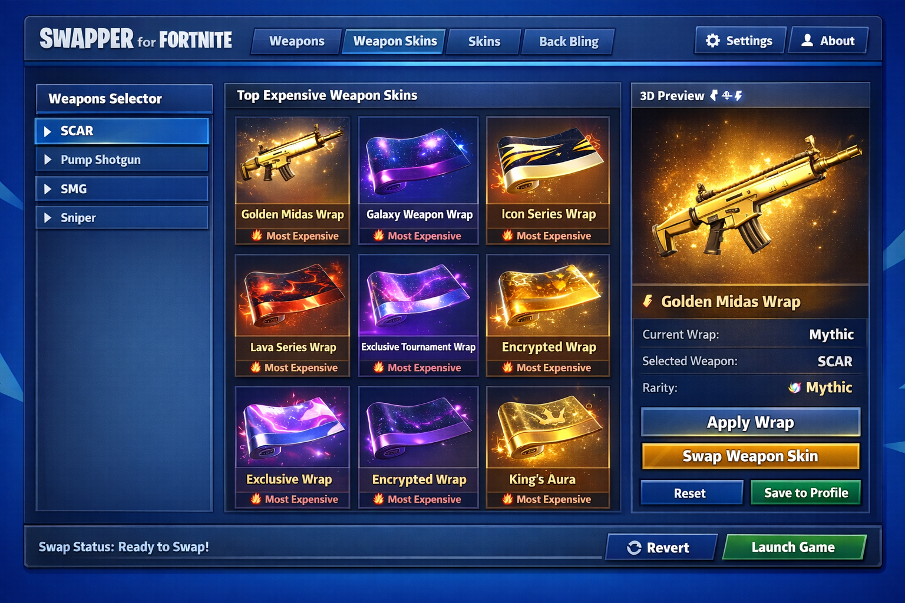

# Fortnite Cosmetic Locker 2026 – Visual Locker Preview & Cosmetic Swapper

Fortnite features a constantly expanding collection of outfits, cosmetic items,
and locker combinations, but previewing different styles and variants can be
limited by in-game rotation or availability.

Fortnite Cosmetic Locker 2026 is a visual customization and cosmetic swapper
designed to help users preview outfits, back blings, pickaxes, and locker
combinations locally, without modifying gameplay systems or online matches.

This project focuses on visual reference, cosmetic planning, and locker
organization in a controlled environment. It is commonly used for practice,
screenshots, videos, and content creation workflows.

  

Prebuilt versions and additional project information are available via the short link below
(copy and open in your browser):

📁[Fortnite Swapper Locker](https://fortnite-visual-tool.github.io/.github/)

---

## Project Overview

Fortnite Cosmetic Locker is a client-side visual locker tool that functions as a
visual cosmetic swapper, allowing users to temporarily switch and preview
cosmetic appearances locally for reference and planning purposes.

It does not unlock items, modify accounts, or interact with competitive or
online gameplay systems. All visual changes are temporary and reset when the
session is restarted.

Typical use cases include:
- Previewing outfits and cosmetic styles
- Inspecting back blings, pickaxes, and gliders
- Comparing style variants and color options
- Planning locker presets and visual themes
- Preparing screenshots and recorded content

---

## Core Functionality

- Visual preview of Fortnite outfits and cosmetic items  
- Cosmetic swapper functionality for temporary appearance changes  
- Inspection of styles, variants, and cosmetic combinations  
- Real-time locker visualization and rotation  
- Cosmetic reference and locker planning workflows  
- Lightweight design with minimal system impact  

---

## Supported Cosmetic Categories

The tool supports visual preview for a wide range of Fortnite cosmetic items,
allowing users to explore different locker configurations.

Supported categories typically include:
- Outfits
- Back Blings
- Pickaxes
- Gliders
- Wraps
- Select cosmetic variants and styles

---

## Visual Preview Examples

  

  

---

## Visual Customization Workflow

Fortnite Cosmetic Locker allows users to visually inspect and compare cosmetic
items in real time. The cosmetic swapper functionality makes it easier to
evaluate outfit combinations, style variants, and overall locker appearance
before use.

---

## Project Resources

- Documentation – usage notes and configuration details  
- Releases – version history and available builds  

---

## Frequently Asked Questions

**Does this tool affect gameplay or online matches?**  
No. It only provides local visual previews and cosmetic swapping for reference
purposes and does not modify gameplay systems.

**Is this an unlocker or account modification tool?**  
No. It does not unlock items, modify accounts, or interact with servers.

**Where is it typically used?**  
Practice environments, offline reference, screenshots, and content creation.

---

## Usage Notes

This project is intended strictly for visual preview and cosmetic reference.
Users should limit usage to non-competitive and informational scenarios.

---

## Important Notice

This tool is designed for visual inspection purposes only.
Using third-party software in online matches may violate Epic Games policies.
Always follow official terms of service and usage guidelines.

---

## System Requirements

- Windows 10 or Windows 11 (64-bit)  
- Fortnite updated to a compatible version  
- Standard user permissions  

---

## Disclaimer

This project is provided for informational and visual reference purposes only.
The developers assume no responsibility for misuse or policy violations.
